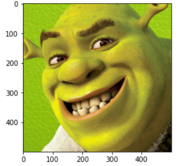
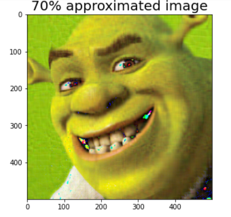

The singular value decomposition (SVD) is a factorization of a real or complex matrix that generalizes the eigendecomposition.
The original image is,

<figure>
	
    <figcaption>Original image</figcaption>
</figure>

<figure>
	
    <figcaption>After SVD
 </figcaption>
</figure>

No_singular values used in R,G,B is: 31 29 73. Then

